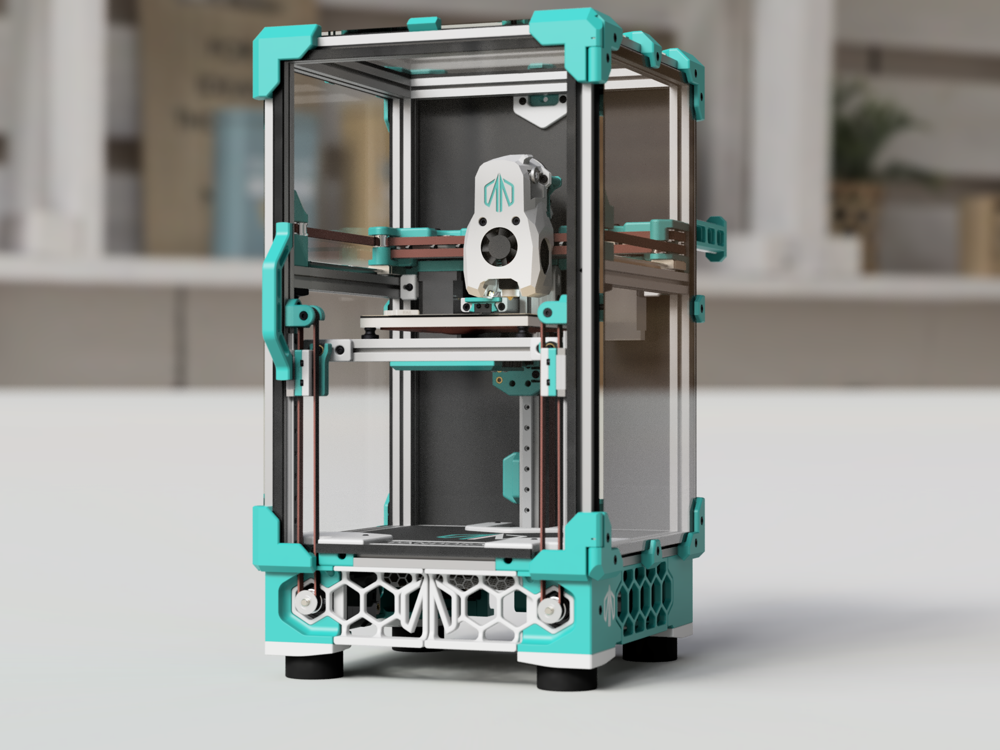

# Pandoras_Box

Pandora's Box is a modified version of the popular Voron V0 3D printer design. The printer has been enhanced with additional X and Y travel, a triple belted Z kinematic system, and an automatic bed tramming and meshing system.

## Features

- Increased X and Y travel - More room for activities!
- Triple belted Z kinematic system for stability and precision during Z-axis movement
- Automatic bed tramming and meshing system for effortless leveling of the print bed
- High-quality prints with improved accuracy and consistency
- Sturdy construction and triple belted Z kinematic system prevent any wobbling or shaking during printing

BOM
---
| Category | Part Description | Qty | Notes |
| --- | --- | --- | --- |
| Filament | Estimates based on the initial release | | |
| | Primary Color | 600g | |
| | Accent Color | 200g | |
| Fasteners | Listed quantities are minimum, buy extra! | | Fastener Kit by [DFH](https://dfh.fm/collections/pandoras-box-by-masturmynd/products/pandoras-box-by-masturmynd-fastener-kit) |
| | M2x6 FHCS | 9 | |
| | M2x6 SHCS | 62 | |
| | M2 Nut | 50 | |
| | M2x10 Self Tapping Screws for Plastic | 9 | |
| | M3x6 BHCS | 46 | |
| | M3x8 BHCS | 48 | |
| | M3x10 BHCS | 16 | |
| | M3x12 BHCS | 15 | |
| | M3x16 BHCS | 13 | |
| | M3x25 BHCS | 5 | |
| | M3x30 BHCS | 10 | |
| | M3x35 BHCS | 4 | |
| | M3x40 BHCS | 4 | |
| | M3x8 SHCS | 36 | |
| | M3x10 SHCS | 51 | |
| | M3x12 SHCS | 5 | |
| | M3x14 SHCS | 3 | Used only with Formbot build plates |
| | M3x16 SHCS | 7 | |
| | M3x20 SHCS | 4 | |
| | M3x25 SHCS | 6 | |
| | M3x30 SHCS | 4 | |
| | M3x35 SHCS | 2 | |
| | 3x6x0.5 Shim Washer | 42 | |
| | M3 Nut | 148 | |
| | M3 Brass heatstake inserts - short M3x5x4 | 62 | |
| | M5x16 BHCS | 4 | |
| | M5 Nut | 4 | |
| Frame | | | Full frame kit by [DFH](https://dfh.fm/collections/pandoras-box-by-masturmynd/products/pandoras-box-by-masturmynd-frame-kit)! |
| | | | Full frame kit available at [DLLPDF](https://dllpdf.com/pandoras-box-frame)! |
| | Makerbeam XL 15x15 350mm | 4 | |
| | Makerbeam XL 15x15 200mm | 13 | |
| | Makerbeam XL 15x15 100mm | 3 | |
| Electronics | | | Stepper Motor Bundle by [DFH](https://dfh.fm/collections/pandoras-box-by-masturmynd/products/pandoras-box-by-masturmynd-motors-kit) |
| | Raspberry Pi Compute Module 4 | 1 | Alternative: Bigtreetech CB1 |
| | Omron Mouse Button - Micro Switch | 2 | |
| | NEMA17 Stepper Motor 45Ncm | 3 | Z Steppers - NEMA14 mounting also available |
| | NEMA14 Stepper Motor 40Ncm | 2 | |
| | MicroSD Card | 1 | |
| | Meanwell LRS-150-24 | 1 | UHP-200-24 is a stronger alternative |
| | IEC320 C14 inlet | 1 | |
| | Hotend thermistor | 1 | |
| | Hotend | 1 | |
| | C13 Power Cord | 1 | |
| | Bigtreetech Manta M8P | 1 | Alternative: Bigtreetech Manta M5P + CAN Toolhead Board |
| | 3M 5952 VHB tape | 1 | |
| | 3010 Blower Fan | 2 | |
| | 3010 Axial fan | 1 | |
| | 4010 Axial fan | 2 | |
| | 24V Heater Cartridge | 1 | |
| Cables | | |
| | Wire 18gauge 10ft | 1 | |
| | Thermal Fuse 125C | 1 | |
| | Nylon Cable Ties (1.8mm wide or smaller) | 50 | |
| | Microfit3 Dual Row (10circuits) Male & Female Plug | 1 | |
| | JST connectors (2pin 3pin 4pin) | ? | |
| | Insulated Crimp Receptical | 4 | |
| | High Flex Wire 22gauge 100ft | 1 | |
| | High Flex Wire 20gauge 10ft | 1 | |
| | 7mm x 7mm cable chain (less than 1/2 meter needed) | 1 | |
| | WAGO 221-412 (OPTIONAL) | 7 | |
| Motion | | | Full Linear Rail Set by [DFH](https://dfh.fm/collections/pandoras-box-by-masturmynd/products/pandoras-box-by-masturmynd-linear-rails-kit) |
| | | | Motion Kit by [DFH](https://dfh.fm/collections/pandoras-box-by-masturmynd/products/pandoras-box-by-masturmynd-motion-kit) |
| | MGN7H Linear Rail with Carriage - 150mm | 5 | |
| | MGN9H Linear Rail with Carriage - 200mm | 1 | |
| | GT2 Open Belt (6mm W) - 4000mm | 1 | |
| | GT2 20T (5mm ID 6mm W) | 5 | |
| | GT2 20T (5mm ID 6mm W) Deflanged | 1 | |
| | F623-RS Bearing | 42 | |
| | KGLM-03 Spherical Bearing	 | 3 | |
| | 5x25mm Shaft (Length varies by setup) | 1 | |
| Buildplate | | |
| | M4 Knurled Nut | 3 | |
| | Spring Steel Flex Buildplate 120x120mm (OPTIONAL) | 1 | |
| | Silicone DC 24V Heater 100x100mm 60W | 1 | |
| | PEI + 3M 468MP (200MP) | 1 | |
| | MIC6 1/4" Plate - 120x120mm | 1 | |
| Panels | | | Full Acrylic / ACM kit By [DFH](https://dfh.fm/collections/pandoras-box-by-masturmynd/products/pandoras-box-by-masturmynd-panels-kit)! |
| | | | Full panels kit available at [DLLPDF](https://dllpdf.com/pandoras-box-panels)! |
| | Rear Panel 3mm thick (See DXF) | 1 | |
| | Deck Panel 3mm thick (See DXF) | 1 | |
| | Acrylic Sheet Clear - 212x332x3mm | 3 | |
| | Acrylic Sheet Clear - 212x212x3mm | 1 | |
| | Single Sided Foam Tape 3mm Thick (5m) | 1 | |
| Bowden | | |
| | Bowden Tube 4x2mm - 1m | 1 | |
| | Bowden Fitting | 2 | |
| Misc. | | |
| | Rubber Foot (1.5x.75", 38x19mm) | 4 | |
| | Bowden Tube 4x3mm - 1m | 1 | |
| | 6mm x 3mm Round Neodymium Magnets | 18 | |
| Extruder | | |
| | NEMA14 36mm pancake Motor with 10 tooth gear | 1 | |
| | MR85 Bearing | 2 | |
| | Bondtech BMG Extruder Kit | 1 | |

## Usage

The Pandora's Box design can be used by hobbyists and professionals alike to produce high-quality 3D prints. The automatic bed tramming and meshing system saves time and effort while ensuring consistent and level prints.

## Contributing

If you would like to contribute to the Pandora's Box design or submit mods specific to this design, please feel free to fork the repository and submit a pull request with your changes. I welcome any and all contributions that help to improve the design and make it even more useful for the 3D printing community.

## License

The Pandora's Box 3D printer design is licensed under the GPLv3 License. Please see the `LICENSE` file for more information.
